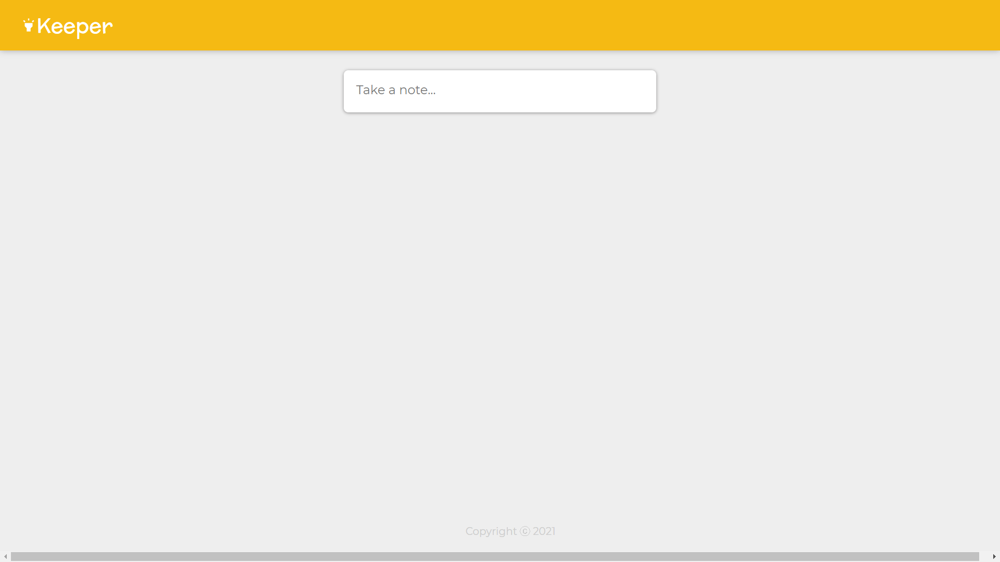
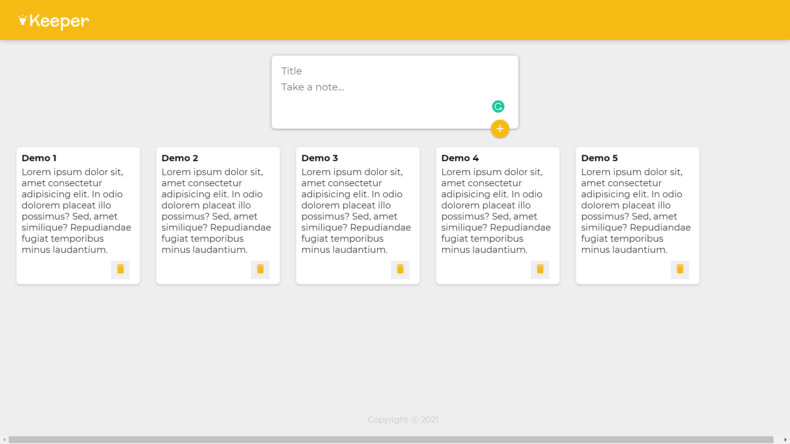

# Keeper App

This app is a simple react web application to manage your notes. This app is similar to the google keep app. Where you can add your note title, note description.

## Features

- Create Note
- Delete Note

## How to use

**Step 1:** To `create` your note, you have to type your note title and note description in the `input field`.
And when you click the `+` button your note will be added.

The notes will be stored on the `local storage`, so when you refresh the page it won't erase your notes.

**Step 2:** To `delete` your notes, you have to click on the delete `icon` which one you want to delete.
Then the note will be removed from your note list.

## Screenshots

 

## Demo

https://clone-keeper-app.netlify.app/
