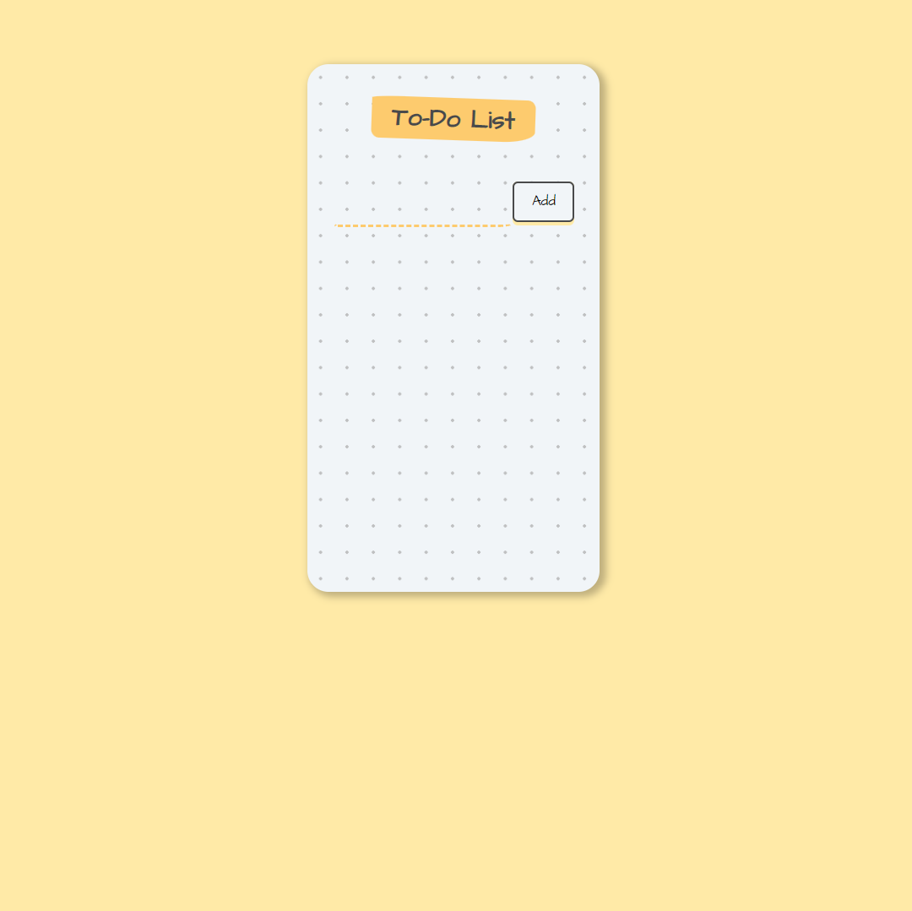
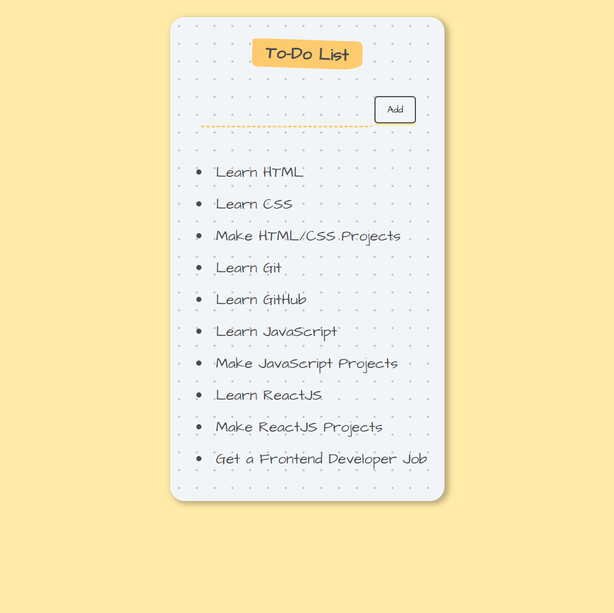

# TO DO LIST

This app is a simple react web application to manage daily task to do.

## Features

- Create To Do List
- Delete To Do List

## How to use

**Step 1:** To `create` your todo list, you have to type your todo in the `input field` on the left side
and click the `Add` button on the right side.

After button got click you can see your todos as a lists on bottom side.

The todo lists will be stored on the `local storage`, so when you refresh the page it won't erase your todos.

**Step 2:** To `delete` your completed task, you have to click on the `task` itself which one you want to delete.
Then the completed task will be removed from the list.

## Screenshots

 

## Demo

https://tohdoh-app.netlify.app/
